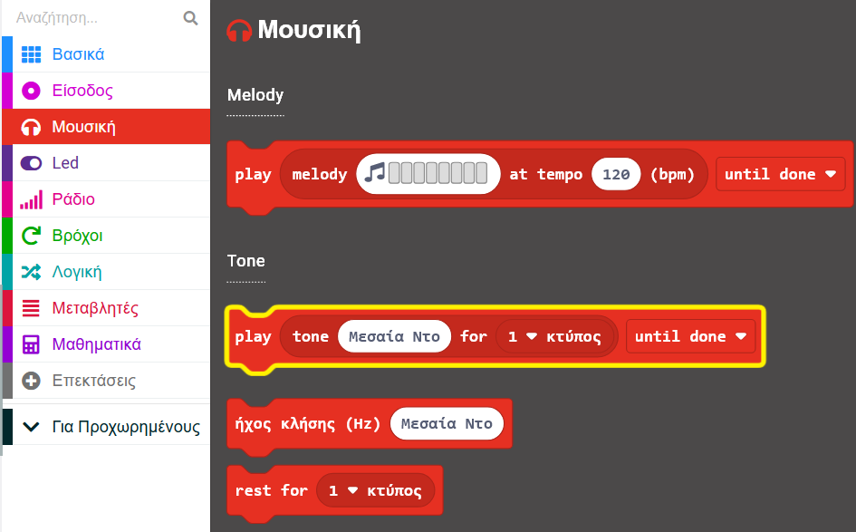
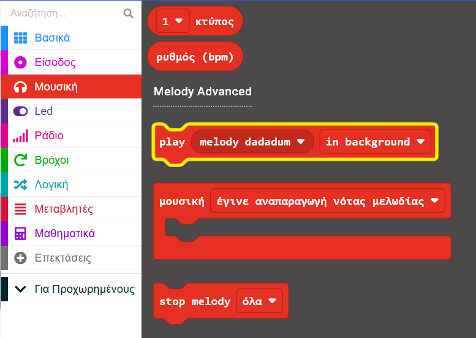
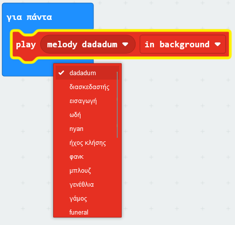
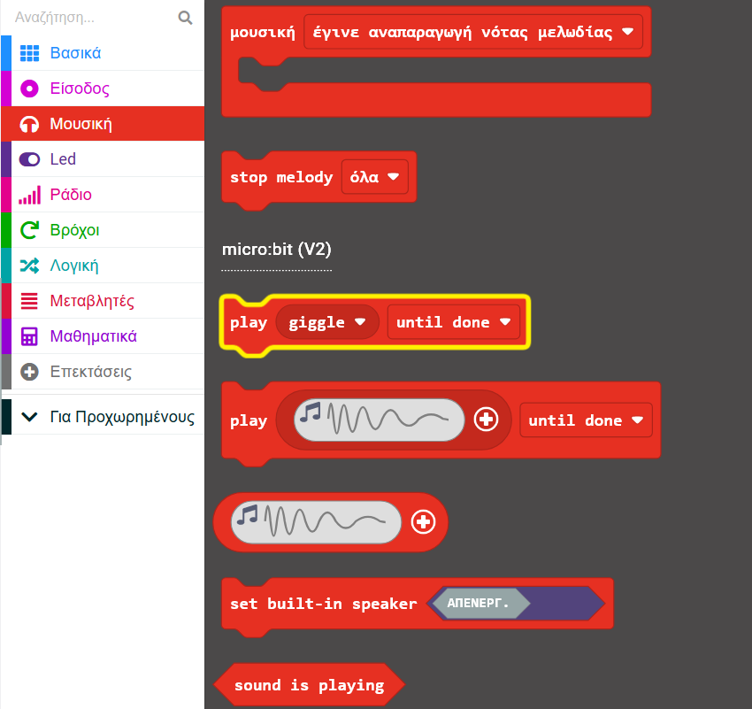
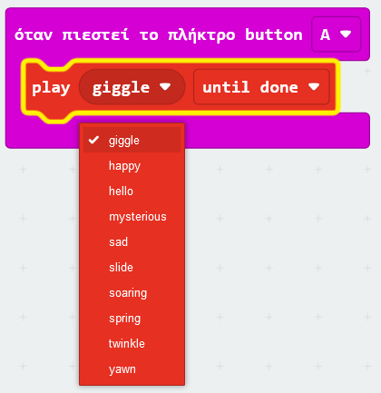

Το micro:bit μπορεί να αναπαράγει ήχους, όπως νότες, μελωδίες και σύντομα κλιπ ήχου (μόνο η έκδοση V2).

Τα μπλοκ σε αυτό το βήμα προέρχονται όλα από το μενού `Μουσική`{:class='microbitmusic'} στην Εργαλειοθήκη.

### Παίξε νότες

Το micro:bit μπορεί να παίξει μεμονωμένες νότες ή τόνους.

Μπορείς να βρεις το μπλοκ `play tone`{:class='microbitmusic'} στο μενού `Μουσική`{:class='microbitmusic'}.

Σύρε το μπλοκ `play tone`{:class='microbitmusic'} μέσα σε οποιοδήποτε μπλοκ βρόχου ή συμβάντος.

Σε αυτό το παράδειγμα, έχει χρησιμοποιηθεί το μπλοκ `κατά την έναρξη`{:class='microbitbasic'}.

Κάνε κλικ στο «Μεσαία Ντο» για να αλλάξεις την επιλεγμένη νότα.

Επίλεξε οποιαδήποτε νότα θέλεις. Σε αυτό το παράδειγμα έχει χρησιμοποιηθεί η "Μεσαία Σολ".

### Παίξε μελωδίες

Μπορείς επίσης να παίξεις μερικές ήδη προγραμματισμένες μελωδίες από το micro:bit σου.

Στο μενού `Μουσική`{:class='microbitmusic'} της Εργαλειοθήκης, βρες το μπλοκ `play melody`{:class='microbitmusic'} στην ενότητα Melody Advanced.

Τοποθέτησε το μέσα σε οποιονδήποτε βρόχο ή μπλοκ συμβάντος.

Σε αυτό το παράδειγμα, έχει χρησιμοποιηθεί το μπλοκ `για πάντα`{:class='microbitbasic'}.

Κάνε κλικ στο `melody dadadum` στο μπλοκ `play melody`{:class='microbitmusic'} για να επιλέξεις διαφορετική μελωδία.

### Παίξε σύντομα κλιπ ήχου (μόνο micro:bit V2)

Στο νεότερο micro:bit, παράλληλα με το μικρόφωνο, έχεις τη δυνατότητα να παίξεις σύντομα κλιπ ήχου.

Άνοιξε το μενού `Μουσική`{:class='microbitmusic'} και βρες το μπλοκ `play giggle`{:class='microbitmusic'} από την ενότητα micro:bit V2.

Τοποθέτησε το μέσα σε οποιονδήποτε βρόχο ή μπλοκ συμβάντος.

Σε αυτό το παράδειγμα, έχει χρησιμοποιηθεί το μπλοκ `όταν πιεστεί το πλήκτρο`{:class='microbitinput'}.

Κάνε κλικ στο τμήμα `giggle` του μπλοκ και επίλεξε ένα άλλο κλιπ.

Σε αυτό το παράδειγμα, έχει χρησιμοποιηθεί το `twinkle`.

### Χρήστες του micro:bit V1

Εάν χρησιμοποιείς micro:bit V1, δεν υπάρχει ηχείο για αναπαραγωγή των ήχων, επομένως αντί αυτού πρέπει να συνδέσεις ακουστικά στα GPIO pins.

Θα χρειαστείς ενσύρματα ακουστικά και δύο καλώδια με κλιπ κροκόδειλου για αυτό το βήμα.

Ρίξε μια ματιά στον [οδηγό από το micro:bit για να σε βοηθήσει να συνδέσεις τα ακουστικά σου](https://makecode.microbit.org/projects/hack-your-headphones/make){:target="_blank"}.

