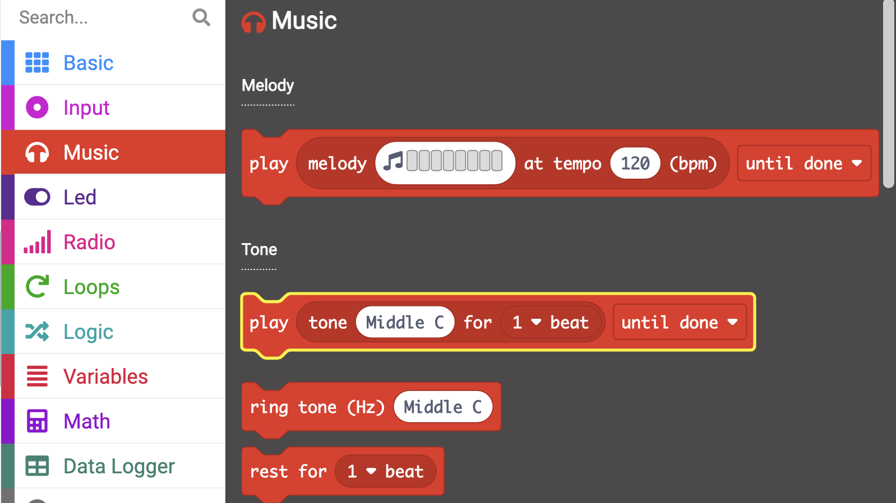
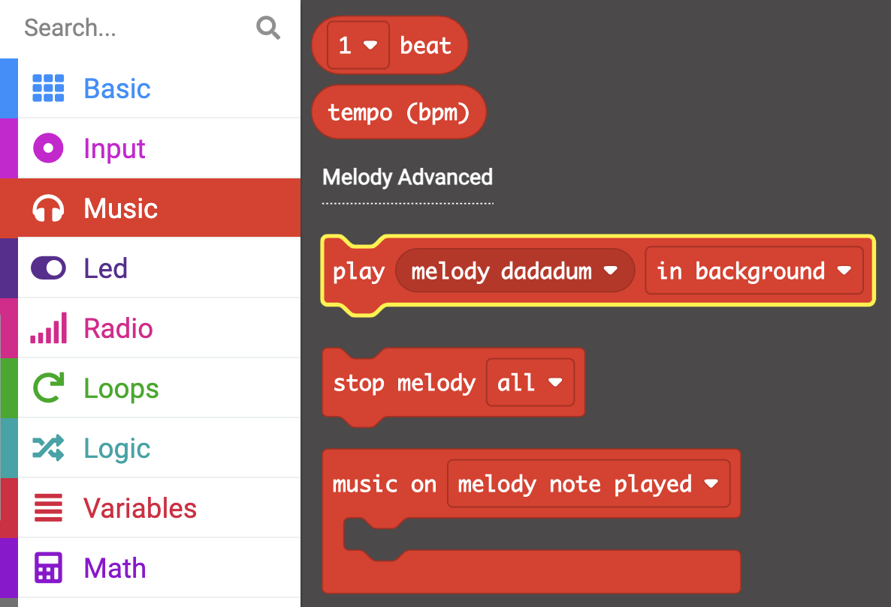
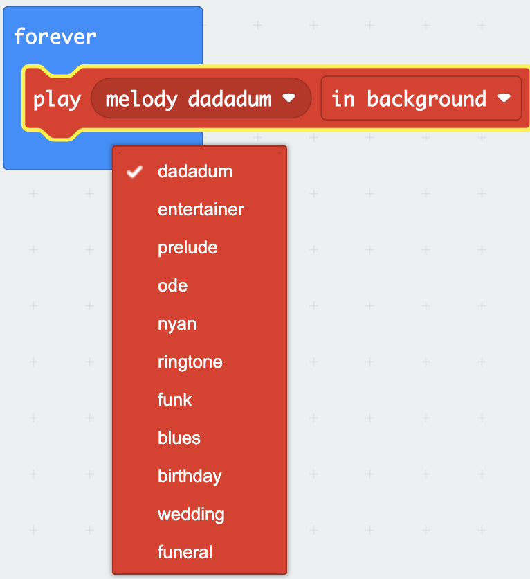
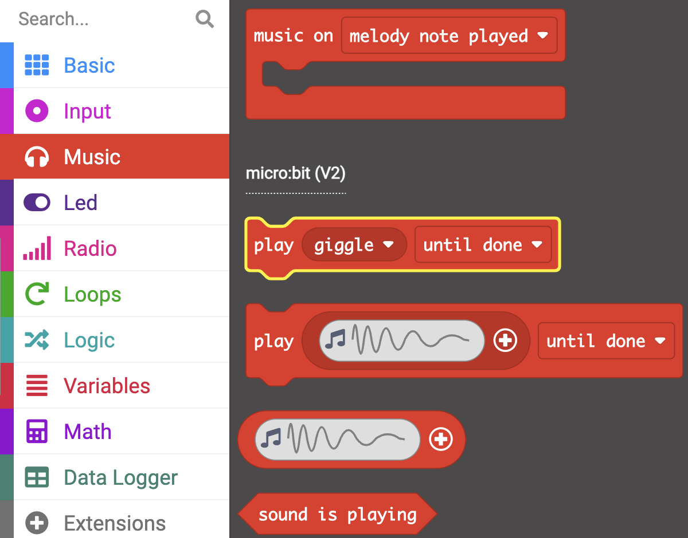
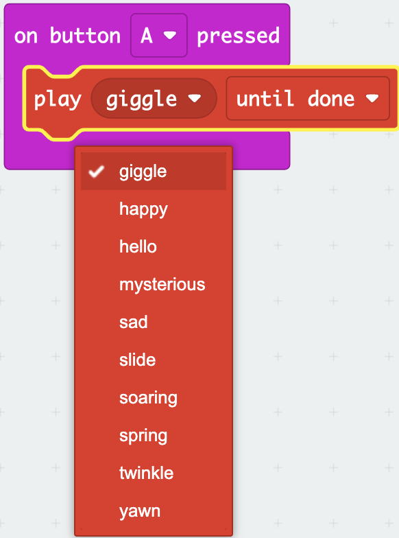

The micro:bit can play sounds including notes, melodies and short audio clips (V2 only).

The blocks in this step will all come from the `Music`{:class='microbitmusic'} menu in the Toolbox.

### Play notes

The micro:bit can play individual notes or tones.

From the `Music`{:class='microbitmusic'} menu you can find the `play tone`{:class='microbitmusic'}.

Drag the `play tone`{:class='microbitmusic'} block inside any loop or event block. 

In this example, the `on start`{:class='microbitbasic'} block has been used.

Click on the `Middle C` to change the currently selected note.

Select any note of your choice. `Middle G` has been used in this example.

### Playing melodies

You can also play some pre-programmed melodies from your micro:bit.

In the `Music`{:class='microbitmusic'} menu of the Toolbox find the `play melody`{:class='microbitmusic'} block in the Melody Advanced section.

Place it inside any loop or event block.

In this example the `forever`{:class='microbitbasic'} block has been used.

Click on the `melody dadadum` on the `play melody`{:class='microbitmusic'} block to select a different melody.

### Playing short audio clips (micro:bit V2 only)

On the newer micro:bit - alongside the microphone you have the ability to play short audio clips.

Open the `Music`{:class='microbitmusic'} menu and find the `play giggle`{:class='microbitmusic'} block from the micro:bit V2 section.

Place it inside  any loop or event block.

In this example the `on button`{:class='microbitinput'} block has been used.

Click on the giggle part of the block and select another clip.

In this example `twinkle` has been used.

### V1 micro:bit users

If you are using a micro:bit V1, there is no speaker to play the sounds, instead you have to attach headphones to the GPIO pins.  

You will need wired headphones and two crocodile clip cables for this step.

Take a look at the [guide from micro:bit to help you attach your headphones](https://makecode.microbit.org/projects/hack-your-headphones/make){:target="_blank"}

