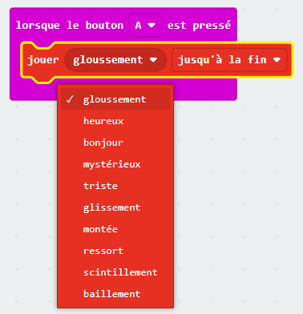

Le micro:bit peut jouer des sons, notamment des notes, des mélodies et de courts clips audio (V2 uniquement).

Les blocs de cette étape proviennent tous du menu `Musique` de la boîte à outils.

### Jouer des notes

Le micro:bit peut jouer des notes ou des sons individuels.

Tu peux trouver le bloc `jouer tonalité`{:class='microbitmusic'} dans le menu `Musique`{:class='microbitmusic'}.

Fais glisser le bloc `jouer tonalité`{:class='microbitmusic'} à l'intérieur d'un bloc de boucle ou d'événement.

Dans cet exemple, le bloc `au démarage`{:class='microbitbasic'} a été utilisé.

Clique sur le `Middle C` pour modifier la note sélectionnée.

Sélectionne la note de ton choix. `Middle G` a été utilisé dans cet exemple.

### Jouer des mélodies

Tu peux également jouer certaines mélodies préprogrammées depuis ton micro:bit.

Dans le menu `Musique`{:class='microbitmusic'} de la boîte à outils, trouve le bloc `jouer mélodie`{:class='microbitmusic'} dans la section Mélodie Avancée.

Place-le à l'intérieur de n'importe quelle boucle ou bloc d'événement.

Dans cet exemple, le bloc `toujours`{:class='microbitbasic'} a été utilisé.

Clique sur le bloc `mélodie dadadum` sur `jouer mélodie`{:class='microbitmusic'} pour sélectionner une mélodie différente.

### Jouer de courts clips audio (micro:bit V2 uniquement)

Sur le dernier micro:bit, à côté du microphone, tu as la possibilité de jouer de courts clips audio.

Ouvre le menu `Musique`{:class='microbitmusic'} et trouve le bloc `jouer gloussement`{:class='microbitmusic'} de la section V2 du micro:bit.

Place-le à l'intérieur de n'importe quelle boucle ou bloc d'événement.

Dans cet exemple, le bloc `lorsque le bouton`{:class='microbitinput'} a été utilisé.

Clique sur la partie `gloussement` du bloc et sélectionne un autre clip.

Dans cet exemple, `scintillement` a été utilisé.

### Utilisateurs du micro:bit V1

Si tu utilises un micro:bit V1, il n'y a pas de haut-parleur pour diffuser les sons, tu devras donc brancher des écouteurs sur les broches GPIO.

Tu auras besoin d’écouteurs filaires et de deux câbles à pince crocodile pour cette étape.

Jette un œil au [guide de micro:bit pour t'aider à brancher tes écouteurs](https://makecode.microbit.org/projects/hack-your-headphones/make){:target="_blank"}.

