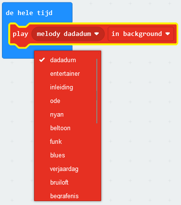

De micro:bit kan geluiden afspelen, inclusief noten, melodieën en korte audiofragmenten (alleen V2).

De blokken in deze stap komen allemaal uit het `Muziek`{:class='microbitmusic'} menu in de Toolbox.

### Noten spelen

De micro:bit kan individuele noten of tonen spelen.

Je kunt het blok `play tone`{:class='microbitmusic'} (speel toon) vinden in het `Muziek`{:class='microbitmusic'} menu.

Sleep het `play tone`{:class='microbitmusic'} blok in een lus of gebeurtenisblok.

In dit voorbeeld is het blok `bij opstarten`{:class='microbitbasic'} gebruikt.

Klik op de `Midden C` om de geselecteerde noot te wijzigen.

Selecteer een noot naar keuze. In dit voorbeeld is 'Midden G' gebruikt.

### Speel melodieën af

Je kunt ook enkele voorgeprogrammeerde melodieën op je micro:bit afspelen.

Zoek in het menu `Muziek`{:class='microbitmusic'} van de Toolbox het blok `play melody`{:class='microbitmusic'} (speel melodie) in de sectie Melody (Melodie) Geavanceerd.

Plaats het in je lus of gebeurtenis blok.

In dit voorbeeld is het blok `de hele tijd`{:class='microbitbasic'} gebruikt.

Klik op het `melody dadadum` blok van het `play melody`{:class='microbitmusic'} blok om een andere melodie te selecteren.

### Speel korte geluidsfragmenten af (alleen micro:bit V2)

Op de nieuwe micro:bit heb je, naast de microfoon de mogelijkheid om korte geluidsfragmenten af te spelen.

Open het `Muziek`{:class='microbitmusic'} menu en zoek het `play giechelen`{:class='microbitmusic'} blok uit het micro:bit V2 gedeelte.

Plaats het in je lus of gebeurtenis blok.

In dit voorbeeld is het `wanneer knop wordt ingedrukt`{:class='microbitinput'} blok gebruikt.

Klik op het `giechelen`-gedeelte van het blok en selecteer een ander fragment.

In dit voorbeeld is 'fonkeling' gebruikt.

### V1 micro:bit-gebruikers

Als je een micro:bit V1 gebruikt, is er geen luidspreker om de geluiden af te spelen, maar moet je een koptelefoon op de GPIO-pinnen aansluiten.

Voor deze stap heb je een bedrade koptelefoon en twee krokodillenklemmen nodig.

Bekijk de [gids van de micro:bit om je te helpen je koptelefoon aan te sluiten](https://makecode.microbit.org/projects/hack-your-headphones/make){:target="_blank"}.
